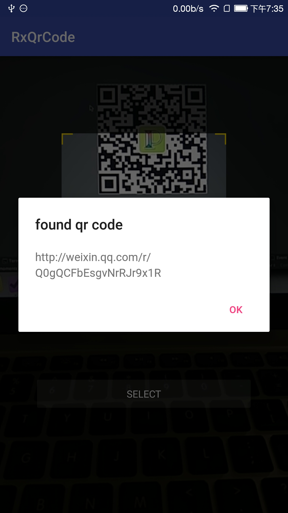

# RxQrCode

When QrCode meets RxJava...

[  ](https://bintray.com/piasy/maven/RxQrCode/_latestVersion)



## Usage

### dependency

``` gradle
allprojects {
    repositories {
        maven {
            url  "http://dl.bintray.com/piasy/maven"
        }
    }
}

compile 'com.github.piasy:RxQrCode:1.3.0'
```

### initialize

Because RxQrCode use [CameraCompat](https://github.com/Piasy/CameraCompat) for camera scan, you need initialize it:

``` java
// initialize in application's onCreate
CameraCompat.init(getApplicationContext());
```

### prebuilt scanner view

Also because RxQrCode use [CameraCompat](https://github.com/Piasy/CameraCompat) for camera scan, you need add a preview container ViewGroup.

``` xml
<FrameLayout
        android:id="@+id/mPreviewContainer"
        android:layout_width="match_parent"
        android:layout_height="match_parent"
        />

<com.github.piasy.rxqrcode.view.HoleContainer
        android:layout_width="match_parent"
        android:layout_height="match_parent"
        app:outside_color="#b2000000"
        >
    <com.github.piasy.rxqrcode.view.WeChatQrScannerView
            android:layout_width="235dp"
            android:layout_height="235dp"
            android:layout_gravity="center_horizontal"
            android:layout_marginTop="110dp"
            app:bar_height="2dp"
            app:bar_margin="10dp"
            app:bar_width="230dp"
            app:moving_bar="@drawable/moving_bar"
            app:moving_speed="5"
            app:side_bg="@drawable/side_bg"
            />
</com.github.piasy.rxqrcode.view.HoleContainer>
```

### scan from camera

Call `RxQrCode.scanFromCamera` from your `onCreate` of Activity/Fragment.

**Note that you must add** `getWindow().addFlags(WindowManager.LayoutParams.FLAG_HARDWARE_ACCELERATED)` in your Activity's `onCreate`, otherwise the camera preview may not show.

~~~ java
@Override
public void onCreate(Bundle savedInstanceState) {
    super.onCreate(savedInstanceState);

    RxQrCode.scanFromCamera(savedInstanceState, getActivity().getSupportFragmentManager(),
            R.id.mScannerPreview, this)
            .observeOn(AndroidSchedulers.mainThread())
            .subscribe(result -> {
                // you got the scan result
            }, e -> {
                // other error happened, **code not found won't get there**
            });
}
~~~

### scan from picture

``` java
RxQrCode.scanFromPicture(realPath)
        .subscribeOn(Schedulers.io())
        .observeOn(AndroidSchedulers.mainThread())
        .subscribe(result -> {
            // you got the result
        }, e -> {
            Toast.makeText(getContext(), "code not found",
                    Toast.LENGTH_SHORT).show();
        });
```

### generate qr code

``` java
RxQrCode.generateQrCodeFile(getContext(), "piasy", 200, 200)
        .subscribeOn(Schedulers.computation())
        .subscribe(file -> {
            // you got the qr code image file
        });
```

### scan from camera backpressure problem

Note that scan result from camera will be emitted continuously, you need handle backpressure issue currently, please refer to [full example here](https://github.com/Piasy/RxQrCode/blob/master/app/src/main/java/com/github/piasy/rxqrcode/example/QrScanFragment.java).

## Try demo app

Demo app can be downloaded from https://fir.im/RQR . Thanks for fir.im!
